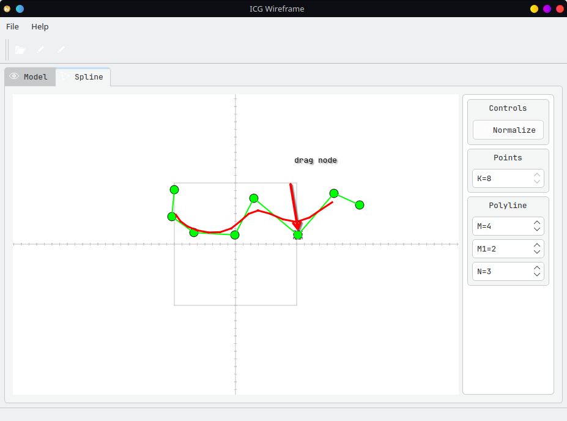
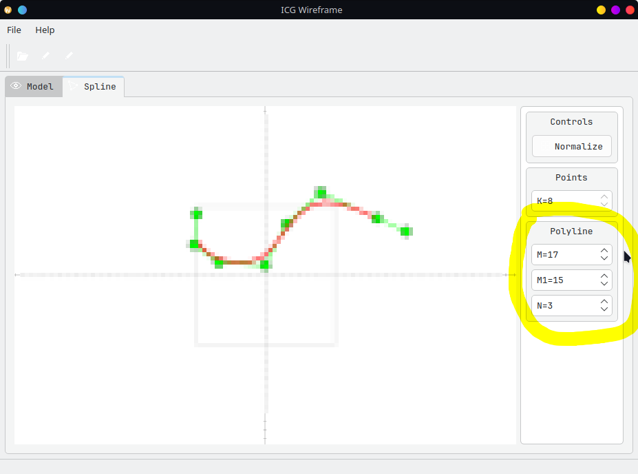
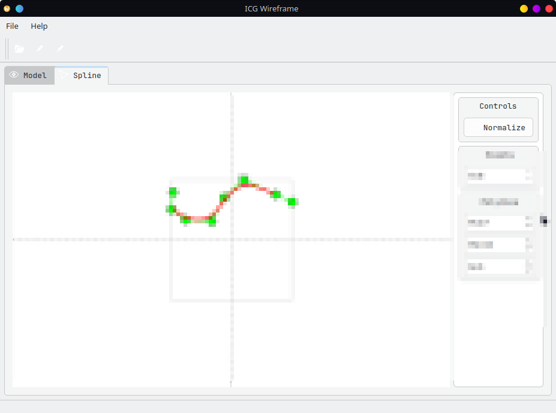
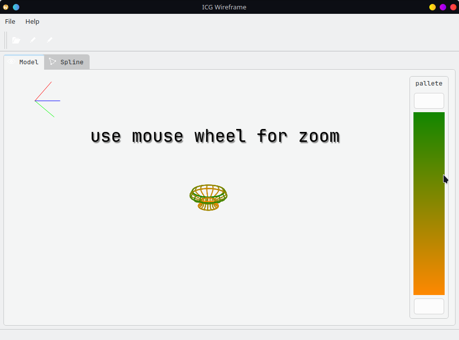
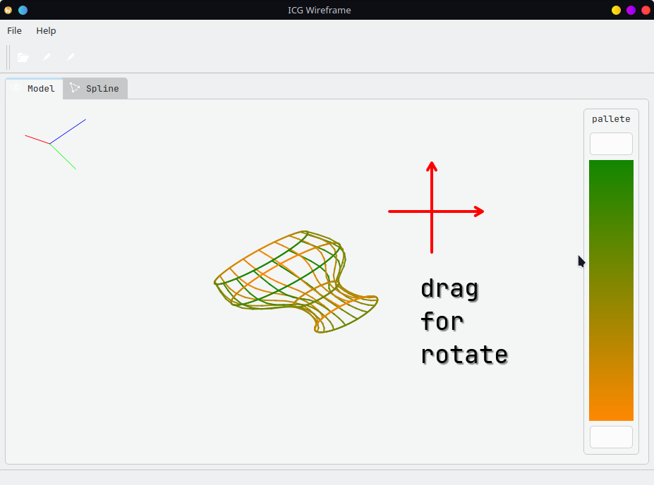
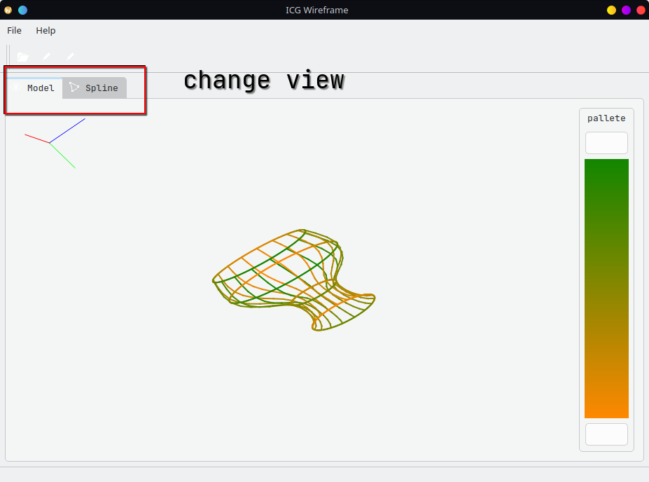
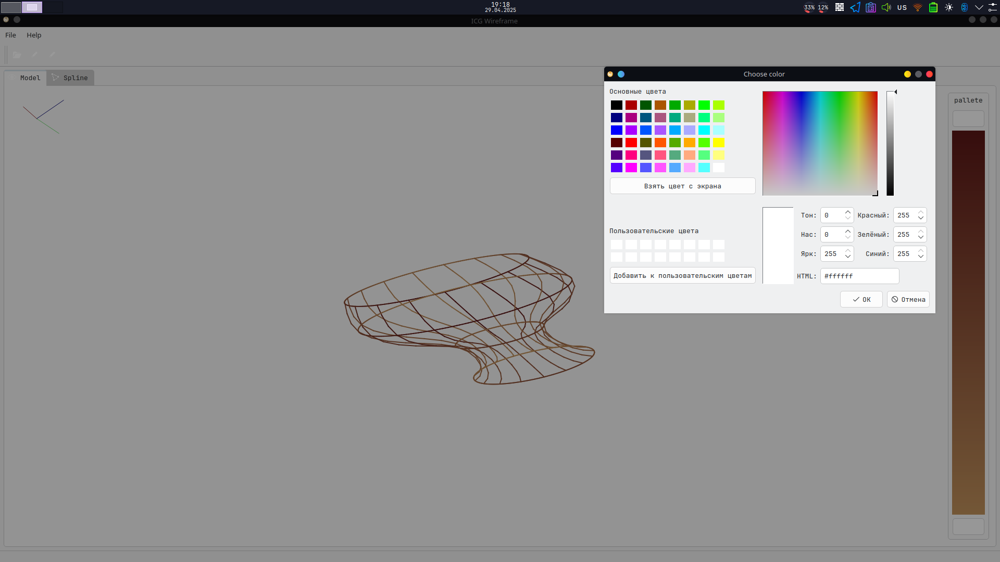

# ICG Wireframe

Simple application for B-Spline based 3D modeling

# Build and Run

You need Qt6.5+ and Eigen3.3 to run.

**build**

```bash
cmake -S . -B build
cmake --build build --parallel 8
```

**run**

```bash
./build/icg_wireframe
```

# Usage

You can read help dialog in application;

- Drag node to move
- Left click to add node
- Right click to delete node

  

- Setup polyline config

  

- Pass figure in \[-1, 1\] rect

  

- Zoom in / Zoom out
- Use double click to reset zoom settings

  

- Click&Drag to rotate figure

  

- Switch from model to editor

  

- Change color

  
